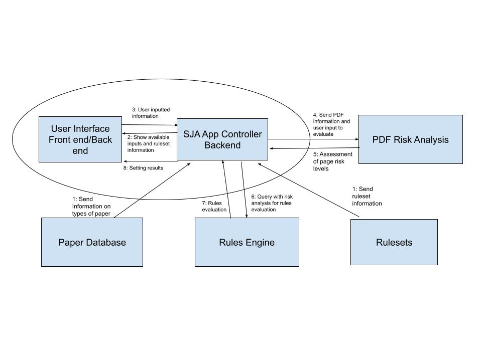

# PPSI

## Deploying All Components

The following steps will deploy the complete Smart Job Advisor website and backend APIs using Docker. Futher explanations of each component can be found below.

1. Build the PDF analysis container, then build and run the backend container.

```
$ git clone https://github.com/OSU-Capstone-Group/PPSI
$ cd PPSI/pdf
$ docker build . -t sja-pdf
$ cd ../be
$ docker build . -t sja-be
$ docker run -d -v path/to/repo/be/test/config/ruleset/T24:/opt/sja/rulesets/T24:ro -v path/to/repo/be/test/config/paperdb.csv:/opt/sja/paperdb.csv:ro -p 8000:80 sja-be:latest dev
```

2. Build and run the dev file upload server container.

```
$ git clone https://github.com/OSU-Capstone-Group/file-upload-server-example
$ cd file-upload-server-example
$ docker build . -t sja-file-server
$ docker run -d -p 8001:80 sja-file-server:latest
```

3. Build the frontend container.

```
$ cd PPSI/fe
$ docker build . -t sja-fe
```

4. Create a Google API key...

5. Create a copy of the template frontend configuration file from `PPSI/fe/src/config.json`. Add the correct endpoints for the backend API `sjaApiUrl`, the dev file upload server `sjaFileApiUrl`, and the Google API key. Example:

```json
{
  "googleApiKey": "myapikey",
  "sjaApiUrl": "http://example.com:8000/",
  "sjaFileApiUrl": "http://example.com:8001/"
}
```

6. Run the frontend container.

```
$ docker run -d -v path/to/config.json:/app/src/config.json -p 80:3000 sja-fe
```
7. Intall a web-browser extension to unblock CORS (if there are errors relating to CORS). 
  One that works well is [CORS Unblock](https://add0n.com/access-control.html). NOTE: You will need to turn on 'Enable Acess-Control-[Allow/Expose] Headers'

## PDF Analysis

### Usage

Requires the following dependencies.

 - OpenCV
 - jq
 - OpenSSL 1.0.2

#### Source

```
$ cd pdf
$ g++ pdf_algorithm.cpp -o pdf_analyze $(pkg-config --cflags --libs opencv4)
$ ./pdf_analyze "myfile.pdf"
```

#### Docker

Mount a directory containing PDFs and specify the location of the file to analyze.

``` 
$ cd pdf
$ docker build . -t sja-pdf
$ docker run -v path/to/repo/pdf/pdfs:/app/pdfs sja-pdf:latest "./pdfs/myfile.pdf"
```

## Backend

### Usage

Requires NodeJS 17+. Older versions may work but have not been tested.

```
$ cd be/src
$ npm install
$ npm run dev
```

By default the Rules Engine expects configuration files to be located in `/opt/sja/`. This can be overriden by specifying a custom config file. 

```
$ npm run dev -- -s "path/to/my-custom.settings.json"
```

An example for local development is located in `be/test/local-example.settings.json`.

#### Docker

This image extends the PDF Analysis Engine's Docker image to provide the analyzer binary. You must build that image first with the tag `sja-pdf`.

```
$ cd be
$ docker build . -t sja-be
```

You'll need to mount at least one ruleset.

```
$ docker run -v path/to/repo/be/test/config/ruleset/T24:/opt/sja/rulesets/T24:ro -v repo/be/test/config/paperdb.csv:/opt/sja/paperdb.csv:ro -p 8000:80 sja-be:latest dev
```

Verify that the container is reachable:

```
$ curl http://localhost:8000/       
{
    "status": "ok"
}
```

## Frontend

#### Live Development Server

```
$ cd fe
$ npm install
$ npm run dev
```

Open `http://localhost:3000/` in a web browser.

#### Docker

Currently this will deploy the frontend in development mode.

```
$ cd fe
$ docker build . -t sja-fe
$ docker run -v path/to/config.json:/app/src/config.json -p 3000:3000 sja-fe
```

## Tests

The `docker-compose.yml` file in the repository root contains several configurations for automated testing.

### Automated Rules Engine API Tests

Uses [Dredd](https://dredd.org/en/latest/index.html) to test all endpoints listed in the Swagger API specification in `be/test/api-description.yml`.

```
$ docker-compose build sja_be_api_tests
$ docker-compose build sja_be
$ docker-compose up sja_be_api_tests sja_be --abort-on-container-exit --exit-code-from sja_be_api_tests
```

You can run the tests in verbose mode to view the successful API calls. When using `run` you'll need to manually stop the `sja_be` container afterwards.

```
$ docker-compose run sja_be_api_tests -d
$ docker-compose stop
```

### 2023 Edit: Repository Layout 

This repository combines source code created by 2021-2022 and 2022-2023 capstone teams. These are organized into separate folders. 

The 2021-2022 team implemented all functionalities described above. These span the three folders: 

-  `./pdf`
- `./be`
- `./fe`

These contain source code for the pdf analysis engine, the backend rules engine, and the front end user interface respectively. 

The 2022-2023 team implemented more enhanced image analysis functionalities in OpenCV's Python library in `./research_findings`. These are Python implementations of the wrinkle/curl, flaking, and streaking risks. These are located in the following folders: 

-  `./research_findings/wrinkle-curl-risk`
-  `./research_findings/flaking-risk`
- `./research_findings/streaking-risk`

Each of these folders contain individual README's that include background information and instructions for running their scripts. 

### 2023 Edit: Code Architecture




