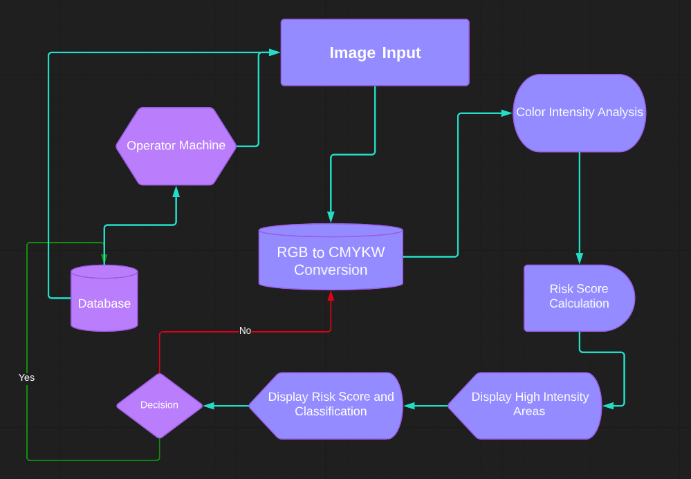

# Flaking Risk Analysis for Printing

The *flaking_risk_analysis* is a Python-based tool for analyzing the risk of flaking in a given image, which can be very useful in pre-emptively identifying potential issues in printing processes.

**_Note: See new section on Python Dependencies 5/12/2023_**

- [Flaking Risk Analysis for Printing](#flaking-risk-analysis-for-printing)
    - [Introduction](#introduction)
    - [Prerequisites](#prerequisites)
    - [Installation](#installation)
    - [Usage](#usage)
    - [Architecture and Functionality](#architecture-and-functionality)
    - [Research Findings](#findings)
    - [Break down](#break-down)
    - [Future Considerations](#future-considerations)

## Introduction

Flaking is a common issue in printing where ink or other material fails to properly adhere to the surface, causing it to flake off. This can lead to significant quality issues in the finished product. The script reads an image, applies color transformations and masking to isolate specific color intensities, and then calculates the flaking risk based on these color distributions. The results are then displayed and saved for further analysis.

## Prerequisites

The project can be run on any system that supports Python, including Windows, macOS, and Linux. No special hardware is required beyond a standard computer. The following tools and libraries are required:

- Python 3
- OpenCV (cv2)
- Numpy
- Scipy
- skimage

## Installation

To install the necessary libraries, you can use pip, which is a package manager for Python. If you have Python installed, pip should also be available. Run the following commands in your terminal to install the necessary libraries:

```bash
pip install opencv-python
pip install numpy
pip install scipy
pip install scikit-image
```    
## Usage

To run the script, you need to pass the path to the image you want to analyze as an argument. Here is an example:

```bash
python3 flaking_risk.py ./images/colorful.jpg
```

## Findings

1. Effective Color Transformation: From the documentation, the flaking_risk_analysis tool is well-equipped to handle complex color transformations. It's capable of converting an RGB image to CMYKW (Cyan, Magenta, Yellow, Key (Black), and White) using the split_to_cmykw() function.

2. Comprehensive Risk Analysis: The tool provides a robust mechanism to compute flaking risk. It effectively applies color thresholding, masking, and counts the proportion of color intensities using OpenCV functions. Furthermore, it distinguishes coverage of different colors assigning different weights to them for the risk calculation, thus increasing the accuracy and specificity of the flaking risk determination.

3. Practical Utility: The tool not only calculates the risk but also classifies it into three categories - low, moderate, or high. This classification helps users make practical and informed decisions about their printing process, making the tool very useful for real-world applications. Additionally, the tool offers a visualization feature, allowing users to visually inspect the regions of high-intensity colors, which can aid in a deeper understanding and investigation of the risk areas.

## Architecture and Functionality

The script is organized into various functions, each with a specific role in the analysis process:

- `split_to_cmykw()`: Converts an RGB image to CMYKW (Cyan, Magenta, Yellow, Key (Black), and White).
- `flaking_test()`: Calculates the coverage of high-intensity blue in the image and determines if the flaking risk is problematic.
- `compute_risk()`: Calculates the overall risk score based on color coverages and border differences.
- `get_border_difference()`, `get_red_coverage()`, `get_green_coverage()`, `get_blue_coverage()`: These functions calculate the coverage of different color intensities in the image.
- `show_high_intensity_red()`, `show_high_intensity_green()`, `show_high_intensity_blue()`: These functions display the parts of the image that have high intensities of the respective colors.
- `main()`: This is the main function that ties everything together. It reads the image, performs the risk analysis, and then displays the results.

The major functional blocks and their interactions can be visualized as follows:


## Break down of the algorithm
Color Analysis: The script defines various ranges for red, green, and blue colors using the Hue, Saturation, and Lightness (HSL) color space. It then applies these color ranges to the image to create masks for each color. The masks are binary images that highlight regions of the image that fall within the specified color range. Each mask is then used to calculate the coverage of that color in the image.

Flaking Test: This function looks for areas of high intensity in the red, green, and blue channels of the image and determines if these high-intensity areas are problematic based on a given threshold.

Color Thresholding and Masking: The script uses OpenCV's inRange function to create binary masks of the image for specific color ranges. The countNonZero function is then used to calculate the proportion of pixels in the image that fall within these ranges.

Risk Calculation: The risk calculation is based on the coverage of different colors in the image, with different weights assigned to different colors. For example, red coverage is considered problematic and increases the risk score, while green coverage reduces the risk score. The total risk score is then used to determine whether the image is considered to have a problematic risk level.

Visualization: The script contains several functions for visualizing the high-intensity regions of the image for each color, as well as the masks used to calculate color coverage.

Risk Classification: Based on the calculated risk score, the script classifies the risk as low, moderate, or high.

# Future Considerations

1. Machine Learning Integration: The integration of machine learning algorithms could help in automating the process of risk analysis. Training a model on a large dataset of images, with known outcomes, could result in a tool that is even more accurate and efficient.

2. GUI Development: A user-friendly graphical interface could be designed to make the tool more accessible to non-technical users. This would allow more people to utilize the tool without needing to understand the underlying Python scripts.
