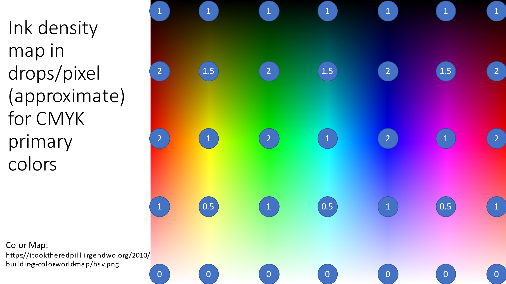
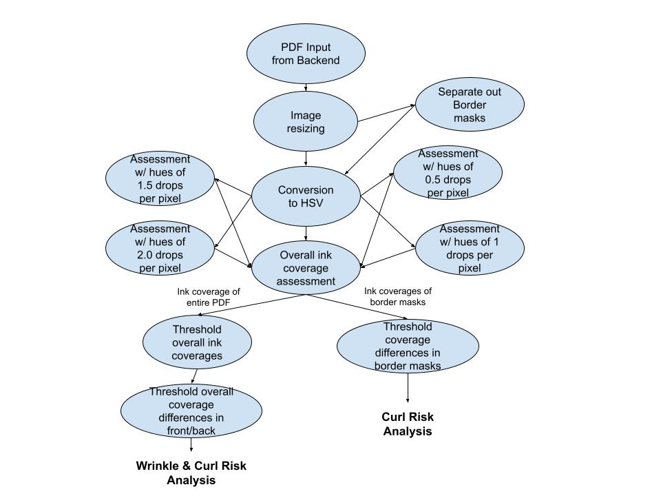

# Wrinkle/Curl Research Findings

# Introduction
Wrinkling/curling is a printing defect characterized by wavy and curling printed paper. It is caused by pages of large amounts of overall ink coverage, especially with widely differing coverages between opposing sides and borders. Our PDF analysis engine currently identifies this risk by searching for different hues of color and weighting their coverage according to their respective ink densities. The engine then assigns a value to the overall ink coverage and assesses the overall ink coverage and difference in coverages between the front and back pages and border to non-border areas to predict the probability of wrinkling/curling occuring on the paper. 

More specifically, wrinkling is a risk that is caused by high overall ink coverage. Curling is caused by high overall ink coverage differences (between front/back sides and border/non-border areas)

## Prerequisites

In order to run this code, your computer will need: 

1. Python and pip (can be downloaded via the link below)

https://www.python.org/downloads/

2. Python OpenCV and numpy modules (can be downloaded using the instructions via the links below)

https://packaging.python.org/en/latest/tutorials/installing-packages/
https://numpy.org/install/
https://pypi.org/project/opencv-python/

## How to Run the Code

This code can be run in two different modes depending on the number of command line arguments: the single page assessment mode and double page assessment mode. 

The single page assessment mode is run with analysis being done on a single image file. This should only be used for debugging and development purposes as we are only considering double sided PDF printing jobs for analysis in user storeis. This will return just the average ink density and the difference in average ink density between border and non border areas for the inputted image. 

From Windows in single page assessment:

`py ./wrinkle_curl.py <input_image_file_path>`

From MacOS and Linux in single page assessment: 

`python ./wrinkle_curl.py <input_image_file_path>`

The double page assessment mode is run with a complete analysis of two inputted images representing the front and page of the page. The script will return two classes representing the overall risk assessment of both pages, considering the differences in average ink density between front and back and differences between border and non-border areas for both images. 

From Windows in double page assessment:

`py ./wrinkle_curl.py <front_image_file_path> <back_image_file_path>`

From MacOS and Linux in double page assessment: 

`python ./wrinkle_curl.py <front_image_file_path> <back_image_file_path>`

Examples (inputs that I used):

`py ./wrinkle_curl.py ./test_images/saturation_color_space.png`

`py ./wrinkle_curl.py ./test_images/0001.jpg ./teset_images/0002.jpg`

## Logging

The first defined constant is the `LOGGING` constant. Set it to true if you would like to run the code and see logging and intermediate images with color and border masks. 

## When Running the Code 

When `LOGGING = False`, the script runs as specified below without intermediate images being displayed to the screen. Page assessments are still printed to the command line. 

If in single page assessment mode and with `LOGGING = True`: 

1. The script will first show the original image and the HSV converted image, pausing execution.
    * To proceed, select any of the displayed images and press any key

2. The script will then begin searching for individual hues categorized into different weights. Each image mask with the colors will be displayed onto the screen. Each time the mask is displayed, the execution will pause.
    * To continue, select any of the displayed images and press any key. 

3. Repeating the previous step will allow the code to run through all of the programmed hues and the script will print an estimated ink density per page value to the command line.

4. The script will create masks isolating border and non-border areas of the inputted images. Both masks will be displayed to the screen, pausing the execution. 
    * To proceed, select any of the displayed images and press any key

5. The script will calculate the average ink densities for both border and non-border areas as specified in steps 1-3. It will take the difference between these densities and print this value to the screen. 

6. The border to non-border differences and ink coverage differences are returned. 

If in double page assessment mode and with `LOGGING = True`:

1. Both pages are analyzed as if they are in single page assessment mode (with the back page flipped horizontally)

2. The script will then compare the difference in overall ink densities of both pages, comparing the difference and marking both pages as problematic if ink density values and difference in ink density values exceed certain threshold values. 

3. The script will then analyze the border and non-border coverage differences in both front and back pages. If these values exceed certain threshold values, both pages are marked as problematic. 

4. The script returns class structures representing the risk scores for both pages and booleans indicating if the pages are problematic 

## Research Findings

After considering several available options for assessing ink coverage on printed pages, we found that a conversion to the HSV color space in OpenCV was the most effective route for selectively picking and thresholding certain values. Here are useful resources for using HSV in OpenCV and visualizing HSV parameters according to their hues: 

https://docs.opencv.org/4.x/df/d9d/tutorial_py_colorspaces.html

https://colorizer.org/

As a result, we decided that rather than assigning a "percent coverage" value to the ink coverage on pages as implemented in previous prototypes, we found that assigning a value for "average ink drops per pixel" a more detailed value for thresholding ink coverages on printed pages. 

We further explored the level of depth we can go into in identifying different hues and masking them to different ink densities. We found that CMYK secondary colors (red, green, and blue) resulted in higher ink densities than CMYK primary colors, and that darker colors resulted in higher ink densities as well. This image was used as a reference for calibrating hue thresholds and mapping certain colors to certain ink densities. The numbers on the image refer to the average number of ink drops per pixel that occur with each color: 

The original image for this can be located in test_images/saturation_color_space.png

## Workflow Diagram

## Future Considerations

We will incorporate this implementation of ink density coverage with additional logic that weighs the differences between coverages in front/back duplex pages and areas inside and outside of borders. Selecting threshold values will be particularly important in this process, therefore, we plan to gather a large set of test images to run this algorithm on to calibrate and determine ideal thresholding values that will identify the levels of wrinkle/curl risk associated with the PDFs. 

Another goal is to implement the use of an internal PDF to JPG conversion tool provided by HP within the code. This tool can be invoked from the command line, but we still have yet to attempt to incorporate this into our logic. This will be achieved if this logic is implemented into the C++ legacy code regardless

There are also test results to consider in the `./testing_results` file. These contain the outputted results when running this algorithm on several test images. All of the testing results run as expected except for one file, labeled as a false positive. 

For this false positive, when running the same test in logging mode, the intermediate images show that the algorithm is not picking up the dark blue background in the back image. This means that the hues that the algorithm is looking for in the ink coverage analysis need to be recalibrated, since they may be missing certain hues. 